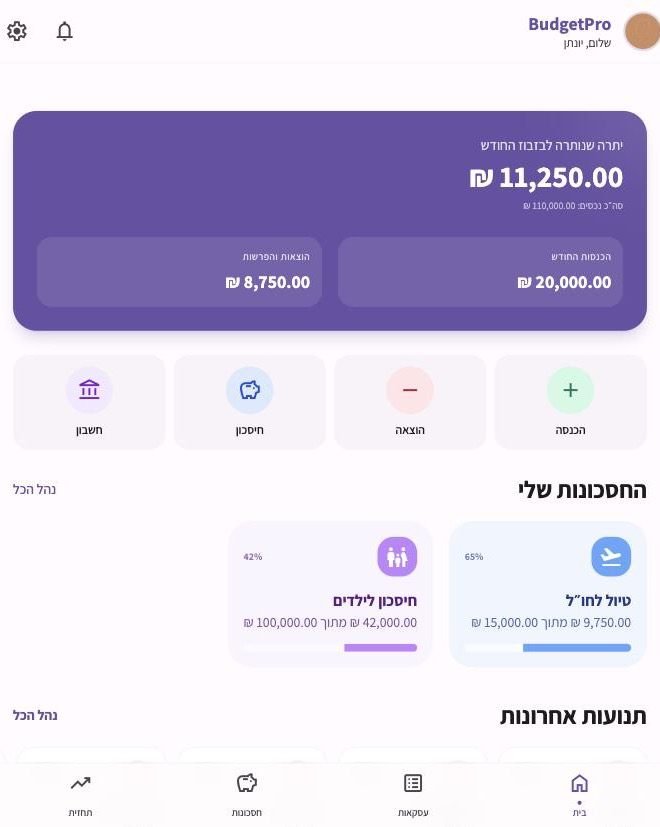
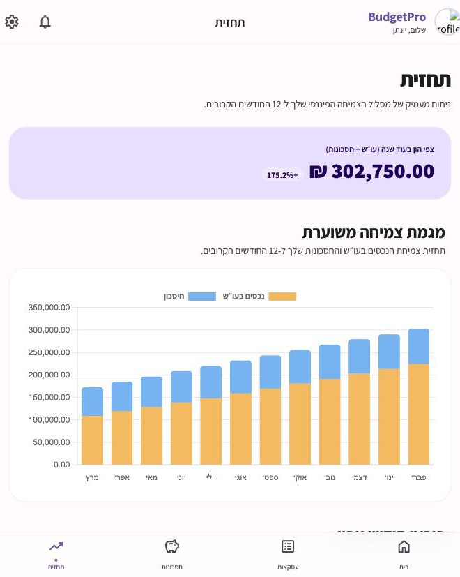
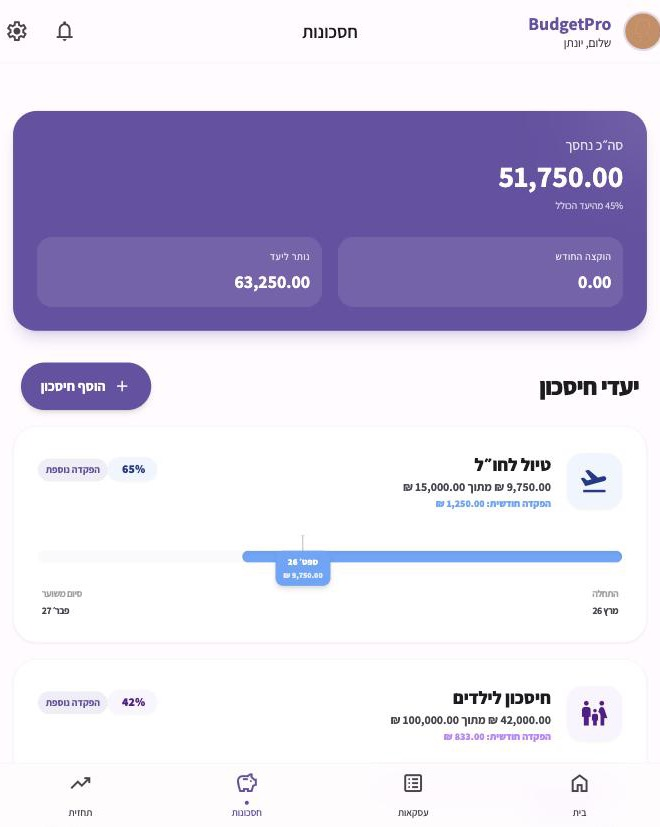
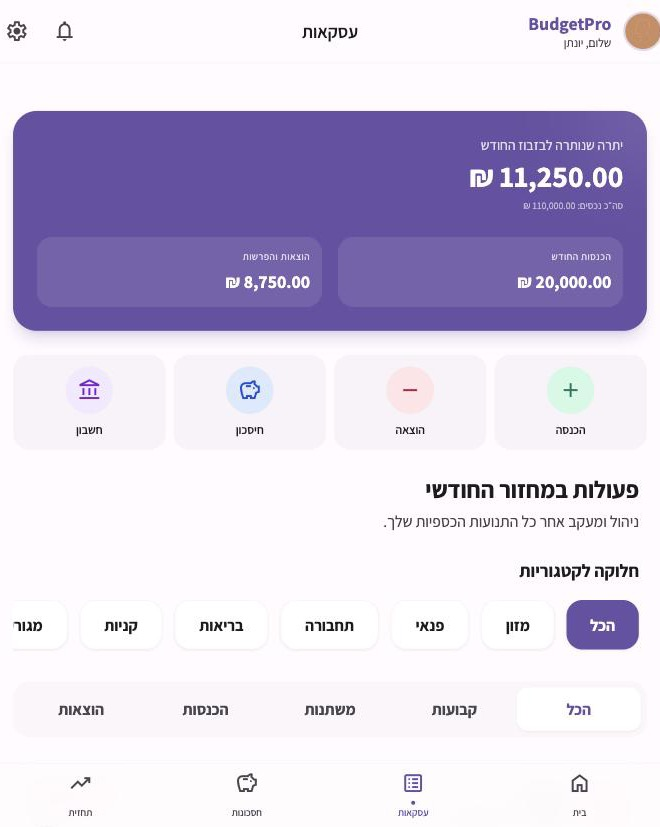
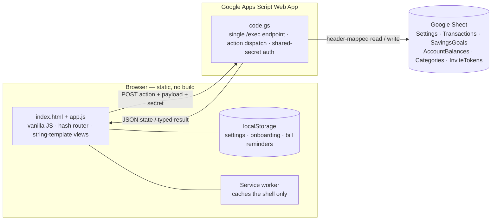

# BudgetPro

[](LICENSE)
[](manifest.json)
[](https://dorkrespi.github.io/BudgetPro-v2/)

A Hebrew (RTL), mobile-first personal-finance app I built to run my own household
budget — and have used for real since early 2026. It turns everything you already
know is coming (salaries, recurring bills, installment plans, standing savings
deposits) into a rolling 12-month projection of what each account will actually
hold, month by month, backed by a Google Sheet instead of a proprietary server.

**Live demo → https://dorkrespi.github.io/BudgetPro-v2/**
The demo opens on the connect screen with an in-app checklist for setting up your
own Google Sheet backend (2 minutes, see [Deploy your own copy](#deploy-your-own-copy)).
The screenshots below show the app populated with sample data.

| Home | Forecast | Savings | Transactions |
|---|---|---|---|
|  |  |  |  |

---

## Contents

- [The problem it solves](#the-problem-it-solves)
- [Features](#features)
- [Architecture](#architecture)
- [Engineering notes](#engineering-notes)
- [Reliability & UX safeguards](#reliability--ux-safeguards)
- [Data model](#data-model)
- [Deploy your own copy](#deploy-your-own-copy)
- [Local development](#local-development)
- [How this gets tested](#how-this-gets-tested)
- [Known limitations](#known-limitations)
- [Tech stack](#tech-stack)
- [License](#license)

## The problem it solves

Off-the-shelf budgeting apps model a US-style calendar month and a single payday.
My real budget doesn't look like that:

- the salary cycle starts on a **configurable day**, not the 1st;
- bills recur on their **own cadence** — monthly, bi-monthly (electricity),
  quarterly (water), annually (insurance);
- a big purchase is a **12-month installment plan**, and only the remaining
  payments should count going forward;
- each savings goal is fed a **fixed monthly deposit** for a fixed duration, and
  some months that deposit is deliberately skipped.

I wanted one number — *"what will the checking account read at the end of
March?"* — that folds all of that in. No spreadsheet I built kept up with the
edits, so I built the app instead.

There's a second reason it's shaped this way: most budgeting apps want your
bank credentials and a monthly fee. This one doesn't. Connect your own Google
Sheet and it's the only backend that ever exists — no third party holds the
data, and there's nothing to keep paying for.

## Features

| Area | What it does |
|---|---|
| **Transactions** | Fixed / variable income and expense; one-off or recurring (monthly, bi-monthly, quarterly, semi-annual, annual); per-category. Variable-price bills remember last month's amount and prompt you to confirm the new one. |
| **Installments** | Split a purchase into *N* monthly payments. The UI shows "payment 4 of 12" inline with the date; the forecast counts only the payments still ahead. |
| **Savings goals** | Target, current balance, monthly deposit, start date and duration, icon and colour. A recurring deposit transaction is kept in sync with the goal automatically; individual months can be skipped. |
| **Accounts** | Checking / savings / investment balances as the forecast's starting points, tracked separately so the projection distinguishes liquid cash from savings. |
| **12-month forecast** | Per-month projected closing balance for checking and savings, with an interactive chart and a month-by-month breakdown of every contributing line. |
| **History view** | A toggle on the Forecast page flips from projection to reconstruction: actual income vs. expense for the last 6 months, a category breakdown for the period, a net-worth trend chart, and a monthly list — built from the same recurring-transaction matching rules as the forecast, run backward instead of forward. |
| **Salary-cycle budgeting** | The "current month" everywhere in the app runs from your payday to the next. |
| **Connect + light onboarding** | First launch asks you to connect a Google Sheet, with an in-app checklist for setting one up. A short 2-step intro (name, household mode) follows *after* the connection succeeds, so nothing typed is ever silently lost. |
| **Partner invites** | Generate a one-time, expiring invite link (WhatsApp deep-link) so a partner connects to the same backend without ever seeing the shared secret. |
| **Native Sheets dashboard** | A "Dashboard" tab in the Google Sheet itself — KPI row, a 6-month income/expense trend chart, a category pie chart, savings-goal progress — refreshed from a **BudgetPro → רענן דשבורד** menu inside Sheets. Works standalone; doesn't need the app open. |
| **Undo, not just confirm** | Deleting *or editing* a transaction, savings goal, or account applies instantly but holds the actual write for 5 seconds behind an undo toast — nothing reaches the Sheet until the window closes. |
| **Categories & charts** | Editable categories with Material Symbols icons; category-breakdown donut on the home screen. |
| **Installable (PWA)** | A web app manifest and a shell-caching service worker mean it can be added to a phone's home screen and opens instantly even on a flaky connection. Live data still always comes from the network — the service worker never caches the Apps Script API. |
| **Dark mode** | Follows the system theme by default, with a Light/Dark/System toggle in Settings. Built on CSS custom properties, not a `dark:`-class retrofit, so the existing Material 3 color tokens (`bg-primary`, `bg-surface`, …) are theme-aware everywhere they're already used. |
| **Quick-add via URL** | `#/transactions?quickAdd=1&merchant=…&amount=…&date=…&type=…` opens the transaction modal pre-filled with those values — built for wiring up an iOS Shortcut, a browser bookmarklet, or any automation that can construct a URL, so logging a purchase is a couple of taps instead of opening the app and filling a form from scratch. |

## Architecture



- **Frontend** — one `index.html` shell and one `app.js` (~3,600 lines): a hash
  router, view functions that return HTML strings, a single `state` object, and a
  modal system. No framework, no bundler, no `node_modules`. Tailwind and Chart.js
  load from a CDN.
- **Backend** — `code.gs`, a Google Apps Script Web App bound to a Google Sheet.
  One `/exec` URL, one `doPost`, dispatched on an `action` string
  (`getBootstrapData`, `syncAll`, `upsertTransaction`, `deleteSavingsGoal`,
  `createInviteToken`, …).
- **Storage** — the Sheet *is* the database. A typed schema (`APP.HEADERS`) drives
  header-mapped read/write helpers, so every row stays readable and hand-editable
  in Google Sheets. Sheet creation and header repair are idempotent.

## Engineering notes

A few things I'd point a reviewer at:

- **The forecast engine** (`generateForecastData`) is the core. For each of the
  next 12 months it re-evaluates every recurring transaction against its cadence
  (`monthsDiff % 2 / 3 / 6 / 12` from the anchor date), every installment plan
  against its active window, and every savings goal against its deposit schedule
  and remaining duration — then walks checking and savings balances forward
  month by month. Skipped-deposit months are stored as a set on the recurring
  transaction and subtracted out.
- **Optimistic writes with a serialized queue.** Every mutation updates local
  state and re-renders immediately, then enqueues a `POST`. Writes are chained
  (`saveQueuePromise = saveQueuePromise.then(runSave)`) so they can't race the
  Sheet. Each action returns a *typed result* that patches local state in place —
  no full refetch on the happy path. A failed write shows a toast, triggers one
  recovery sync, and otherwise keeps the optimistic state rather than clobbering
  it.
- **Salary-cycle dates.** `getCycleDates` derives the budget month from
  `cycleStartDay`, rolling back a month when "now" is before this month's payday;
  transaction dates are remapped into the active cycle for display and filtering.
- **Partner invites.** `resolveInviteToken` is the *only* unauthenticated action —
  by design, it's how a partner bootstraps. Tokens are single-use, time-limited,
  stored in their own sheet, and the endpoint returns the `scriptUrl` + secret
  only on a valid, unused, unexpired token, then marks it consumed.
- **Connect-first onboarding.** The app used to run a 6-step wizard *before* ever
  asking for a Sheet connection, including a "starter questionnaire" (opening
  balance, income, expenses). It looked helpful but was pure busywork: those
  answers only ever touched in-memory state, and the moment the user connected,
  `getBootstrapData` overwrote them with the (empty) new sheet — same for
  `userName` and `cycleStartDay`, both real settings fields silently reset by the
  next fetch. The flow now connects first, then runs a 2-step intro whose answers
  are written back with `saveDataToGAS('updateSettings', ...)` immediately, so
  they survive the fetch that follows.
- **The Sheets dashboard duplicates the forecast's matching logic on purpose.**
  Its menu-triggered refresh (`refreshDashboard`) has no access to the client,
  so `appliesByFrequencyForMonth_` / `installmentActiveForMonth_` in `code.gs`
  are a deliberate server-side port of `generateHistoryData`'s rules rather than
  a shared function — the two are kept in sync by hand, not by construction. It
  also uses calendar months, not the salary-cycle-aware "current month" the rest
  of the app uses.

## Reliability & UX safeguards

Small things that add up to the app not lying to you about its own state:

- **Save-failure toast.** Optimistic UI means an edit appears instantly whether or
  not it reached the Sheet. If the write fails, a toast says so explicitly instead
  of failing silently — the local change is kept and a recovery sync is attempted.
- **Undo for delete and edit.** No `confirm()` dialogs. Deleting or editing a
  transaction, savings goal, or account applies locally right away and shows an
  undo toast for 5 seconds; the actual write is only sent if that window closes
  without a tap on "בטל" (undo). Undoing restores the previous local state and
  sends nothing to the backend at all. One scoped exception: editing a savings
  goal still eagerly (not behind the undo window) syncs its linked recurring
  deposit transaction, to avoid the two staying out of sync mid-undo.
- **Fallback avatar.** A missing profile photo renders a plain icon instead of a
  broken `` with English alt text leaking into an all-Hebrew UI.
- **Scoped service worker.** The cache only ever holds `index.html`, `app.js`, and
  `manifest.json`. Its fetch handler explicitly skips non-GET requests and
  anything off the app's own origin, so a stale cache can never serve financial
  data in place of a live fetch.
- **A locked backend.** Every request to `code.gs` is serialized through
  `LockService.getScriptLock()` before it touches the Sheet. Two overlapping
  requests used to be able to race inside the same read-clear-write cycle -
  one clearing a table's body while the other was still writing to it - which
  could corrupt data outright, not just lose an edit. Now a request that can't
  get the lock within 10s fails cleanly instead of racing.
- **Fail-closed auth.** An Apps Script deployment with no `SECRET_KEY` set used
  to mean *anyone with the URL* had full read/write access, silently. It now
  refuses every request until a secret is configured.
- **Mutations require POST.** `doGet` and `doPost` used to route to the exact
  same dispatch, so a GET request — triggerable by a bare ``, browser
  link-prefetching, or a scanner following URLs with no user behind them —
  could change data as long as it had the secret. GET is now restricted to
  the handful of read-only actions the client actually uses that way.
- **Every request is logged.** One line per request (action + method) and one
  on any thrown error, visible in the Apps Script editor's Executions log —
  there was previously no way to see what happened after the fact without
  reproducing an issue by hand.

## Data model

One tab per entity, first row = headers:

| Sheet | Key columns |
|---|---|
| `Settings` | `key`, `value` (flat key–value) |
| `Transactions` | `id`, `name`, `amount`, `type`, `date`, `category`, `frequency`, `isRecurring`, `isInstallments`, `installmentsTotal`, `installmentsStartDate`, `isVariablePrice`, `lastMonthAmount`, `goalId`, `cycleDate` |
| `SavingsGoals` | `id`, `name`, `target`, `current`, `monthlyAmount`, `startDate`, `durationMonths`, `depositDay`, `icon`, `color` |
| `AccountBalances` | `id`, `name`, `amount`, `type`, `lastUpdated` |
| `Categories` | `name` (icons are a client-side lookup) |
| `InviteTokens` | `token`, `scriptUrl`, `secretKey`, `partnerPhone`, `createdAt`, `expiresAt`, `usedAt`, `isUsed` |

## Deploy your own copy

**Backend (≈2 min):**

1. New Google Sheet → **Extensions → Apps Script**.
2. Replace `Code.gs` with this repo's [`code.gs`](code.gs).
3. **Project Settings → Script properties** → add `SECRET_KEY` = a long random
   string.
4. **Deploy → New deployment → Web app**, *Execute as: Me*, *Who has access:
   Anyone*. Copy the `/exec` URL.

**Frontend:** use the [live demo](https://dorkrespi.github.io/BudgetPro-v2/), or
host your own copy of `index.html` + `app.js` on any static host. On first
launch, paste the `/exec` URL and the same secret into the connect screen — it
has the same checklist above built in. The first sync creates every sheet tab
and seeds default categories.

Nothing sensitive lives in this repo — `scriptUrl` and `secretKey` are entered in
the app and stored only in your browser's `localStorage`.

**Dashboard menu:** after pasting `code.gs`, switch back to the Sheet tab and
reload it once — a **BudgetPro** menu with **רענן דשבורד** appears next to
Extensions/Help (Apps Script's `onOpen` runs automatically for the sheet's
owner). No redeploy needed for the menu itself, only for `doGet`/`doPost`
changes.

## Local development

No install, no build:

```bash
python3 -m http.server 8000   # → http://localhost:8000
```

Edit `app.js` / `index.html`, refresh. Backend changes go in `code.gs`, re-deployed
from the Apps Script editor (or via [`clasp`](https://github.com/google/clasp)).

## How this gets tested

There's no automated test suite yet (see [Known limitations](#known-limitations)).
Every change in this repo's history was instead verified by running the app
against a local static server and driving the real UI — filling in the actual
forms, clicking through onboarding and delete/undo flows, and checking the
browser console for unexpected errors — rather than trusting a diff by
inspection. It's slower than `npm test`, but it's what caught the missing
profile-photo fallback (see above) before it shipped, and confirmed the
onboarding reorder doesn't break the redirect flow for already-connected
users.

The one piece that couldn't be tested that way is the Sheets dashboard
(`refreshDashboard` in `code.gs`) — there's no local emulator for Apps Script,
so it was written carefully against the documented API and verified for real
only after deployment: opened the live Sheet, ran **BudgetPro → רענן דשבורד**
from a clean state, and confirmed the KPI row, 6-month trend chart, category
pie chart, and savings-goal table all populated correctly against real data
on the first run.

## Known limitations

Written down instead of hidden:

- **No automated tests.** Verification is manual (see above). A file this size
  would benefit from at least unit tests around `generateForecastData`, the
  single riskiest function to regress.
- **Last-write-wins sync.** A script-wide lock (see "Reliability & UX
  safeguards" above) keeps two overlapping requests from corrupting the Sheet,
  but there's still no conflict *detection* or merge — two devices editing at
  the same time settle on whoever's write lands second, safely, without a
  warning to either side.
- **`householdMode` and `partnerPhone` aren't in the Sheet's typed schema.**
  `code.gs`'s `normalizeSettingsObject_` only persists eight known settings
  fields, so those two are saved to `localStorage` and pushed to the backend on
  every `updateSettings` call, but silently dropped by the server's own
  normalization — they don't yet survive a fresh login on a second device.
  Fixing it means extending the server-side settings schema.
- **Single shared secret per household.** Anyone with the secret has full
  read/write access; there's no per-user permission model.
- **Dark mode covers structure, not every accent color.** Backgrounds, text,
  cards, and borders are fully theme-aware, but the small colored badges and
  pills (expense/income/savings/alert indicators, built on raw Tailwind
  shades like `bg-rose-50`) don't have bespoke dark variants yet, so they
  read a bit light against the dark background.

## Tech stack

Vanilla JavaScript · Tailwind CSS (CDN) · Chart.js · a Service Worker (PWA) ·
Google Apps Script · Google Sheets · GitHub Pages. Scaffolded in Google AI
Studio, then rebuilt by hand into the vanilla-JS app it is now, with
AI-assisted development along the way.

## License

[MIT](LICENSE) © 2026 [Dor Krespi](https://github.com/dorkrespi)
