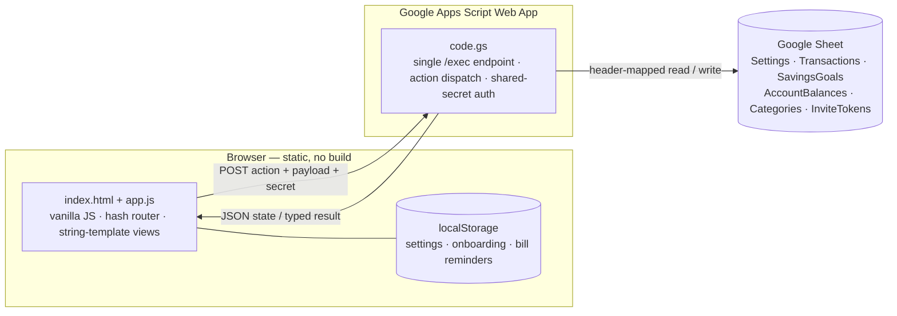

# BudgetPro

[](LICENSE)

A Hebrew (RTL), mobile-first personal-finance app I built to run my own household
budget — and have used for real since early 2026. It turns everything you already
know is coming (salaries, recurring bills, installment plans, standing savings
deposits) into a rolling 12-month projection of what each account will actually
hold, month by month.

**Live demo → https://dorkrespi.github.io/BudgetPro-v2/**
The demo opens on the onboarding screen; connect a Google Sheet backend (2-minute
setup, [below](#deploy-your-own-copy)) to load and persist data. The screenshots
below show the app populated with sample data.

| Home | Forecast | Savings | Transactions |
|---|---|---|---|
|  |  |  |  |

---

## The problem it solves

Off-the-shelf budgeting apps model a US-style calendar month and a single payday.
My real budget doesn't look like that:

- the salary cycle starts on a **configurable day**, not the 1st;
- bills recur on their **own cadence** — monthly, bi-monthly (electricity),
  quarterly (water), annually (insurance);
- a big purchase is a **12-month installment plan**, and only the remaining
  payments should count going forward;
- each savings goal is fed a **fixed monthly deposit** for a fixed duration, and
  some months that deposit is deliberately skipped.

I wanted one number — *"what will the checking account read at the end of
March?"* — that folds all of that in. No spreadsheet I built kept up with the
edits, so I built the app instead.

## Features

| Area | What it does |
|---|---|
| **Transactions** | Fixed / variable income and expense; one-off or recurring (monthly, bi-monthly, quarterly, semi-annual, annual); per-category. Variable-price bills remember last month's amount and prompt you to confirm the new one. |
| **Installments** | Split a purchase into *N* monthly payments. The UI shows "payment 4 of 12" inline with the date; the forecast counts only the payments still ahead. |
| **Savings goals** | Target, current balance, monthly deposit, start date and duration, icon and colour. A recurring deposit transaction is kept in sync with the goal automatically; individual months can be skipped. |
| **Accounts** | Checking / savings / investment balances as the forecast's starting points, tracked separately so the projection distinguishes liquid cash from savings. |
| **12-month forecast** | Per-month projected closing balance for checking and savings, with an interactive chart and a month-by-month breakdown of every contributing line. |
| **Salary-cycle budgeting** | The "current month" everywhere in the app runs from your payday to the next. |
| **Onboarding + partner invites** | Guided first-run setup. Generate a one-time, expiring invite link (WhatsApp deep-link) so a partner connects to the same backend without ever seeing the shared secret. |
| **Categories & charts** | Editable categories with Material Symbols icons; category-breakdown donut on the home screen. |

## Architecture



- **Frontend** — one `index.html` shell and one `app.js` (~3,600 lines): a hash
  router, view functions that return HTML strings, a single `state` object, and a
  modal system. No framework, no bundler, no `node_modules`. Tailwind and Chart.js
  load from a CDN.
- **Backend** — `code.gs`, a Google Apps Script Web App bound to a Google Sheet.
  One `/exec` URL, one `doPost`, dispatched on an `action` string
  (`getBootstrapData`, `syncAll`, `upsertTransaction`, `deleteSavingsGoal`,
  `createInviteToken`, …).
- **Storage** — the Sheet *is* the database. A typed schema (`APP.HEADERS`) drives
  header-mapped read/write helpers, so every row stays readable and hand-editable
  in Google Sheets. Sheet creation and header repair are idempotent.

## Engineering notes

A few things I'd point a reviewer at:

- **The forecast engine** (`generateForecastData`) is the core. For each of the
  next 12 months it re-evaluates every recurring transaction against its cadence
  (`monthsDiff % 2 / 3 / 6 / 12` from the anchor date), every installment plan
  against its active window, and every savings goal against its deposit schedule
  and remaining duration — then walks checking and savings balances forward
  month by month. Skipped-deposit months are stored as a set on the recurring
  transaction and subtracted out.
- **Optimistic writes with a serialized queue.** Every mutation updates local
  state and re-renders immediately, then enqueues a `POST`. Writes are chained
  (`saveQueuePromise = saveQueuePromise.then(runSave)`) so they can't race the
  Sheet. Each action returns a *typed result* that patches local state in place —
  no full refetch on the happy path. A failed write triggers one recovery sync
  and otherwise keeps the optimistic state rather than clobbering it.
- **Salary-cycle dates.** `getCycleDates` derives the budget month from
  `cycleStartDay`, rolling back a month when "now" is before this month's payday;
  transaction dates are remapped into the active cycle for display and filtering.
- **Partner invites.** `resolveInviteToken` is the *only* unauthenticated action —
  by design, it's how a partner bootstraps. Tokens are single-use, time-limited,
  stored in their own sheet, and the endpoint returns the `scriptUrl` + secret
  only on a valid, unused, unexpired token, then marks it consumed.

## Data model

One tab per entity, first row = headers:

| Sheet | Key columns |
|---|---|
| `Settings` | `key`, `value` (flat key–value) |
| `Transactions` | `id`, `name`, `amount`, `type`, `date`, `category`, `frequency`, `isRecurring`, `isInstallments`, `installmentsTotal`, `installmentsStartDate`, `isVariablePrice`, `lastMonthAmount`, `goalId`, `cycleDate` |
| `SavingsGoals` | `id`, `name`, `target`, `current`, `monthlyAmount`, `startDate`, `durationMonths`, `depositDay`, `icon`, `color` |
| `AccountBalances` | `id`, `name`, `amount`, `type`, `lastUpdated` |
| `Categories` | `name` (icons are a client-side lookup) |
| `InviteTokens` | `token`, `scriptUrl`, `secretKey`, `partnerPhone`, `createdAt`, `expiresAt`, `usedAt`, `isUsed` |

## Deploy your own copy

**Backend (≈2 min):**

1. New Google Sheet → **Extensions → Apps Script**.
2. Replace `Code.gs` with this repo's [`code.gs`](code.gs).
3. **Project Settings → Script properties** → add `SECRET_KEY` = a long random
   string.
4. **Deploy → New deployment → Web app**, *Execute as: Me*, *Who has access:
   Anyone*. Copy the `/exec` URL.

**Frontend:** use the [live demo](https://dorkrespi.github.io/BudgetPro-v2/), or
host your own copy of `index.html` + `app.js` on any static host. In onboarding,
paste the `/exec` URL and the same secret. The first sync creates every sheet tab
and seeds default categories.

Nothing sensitive lives in this repo — `scriptUrl` and `secretKey` are entered in
the app and stored only in your browser's `localStorage`.

## Local development

No install, no build:

```bash
python3 -m http.server 8000   # → http://localhost:8000
```

Edit `app.js` / `index.html`, refresh. Backend changes go in `code.gs`, re-deployed
from the Apps Script editor (or via [`clasp`](https://github.com/google/clasp)).

## Tech stack

Vanilla JavaScript · Tailwind CSS (CDN) · Chart.js · Google Apps Script · Google
Sheets · GitHub Pages. Scaffolded in Google AI Studio, then rebuilt by hand into
the vanilla-JS app it is now, with AI-assisted development along the way.

## License

[MIT](LICENSE) © 2026 [Dor Krespi](https://github.com/dorkrespi)
